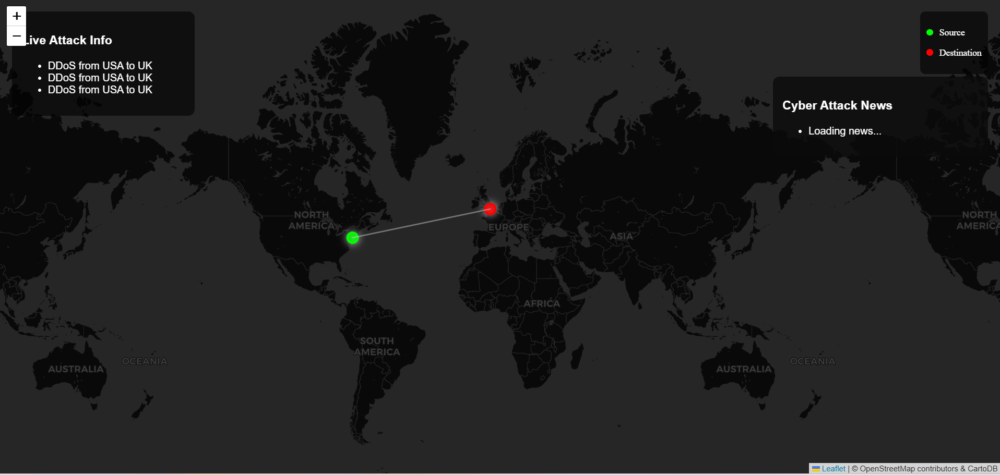

# 🌐 Cyber Threat Map (WIP 🚧)

A simple threat map project that visualizes real-time global cyberattacks using data from APIs like CheckPoint, Fortinet, and Radware. Built with Flask + JS, this map displays source countries, attack types, and other threat info on an interactive map.

> ⚠️ **Note:** This is a work in progress and may have bugs, incomplete features, and dirty code 🙃 Still learning & building!

---

## 📷 Project Screenshot



## 🔧 Features

* 🌍 Real-time cyberattack visualization
* 📡 Data from CheckPoint, Fortinet, Radware APIs
* 🧠 IP geolocation using public APIs like `ip-api`, `ipinfo`, and `ipwhois`
* 🧪 Flask backend serving data
* 🎨 Basic frontend with HTML, CSS, JS

---

## 🗂 Project Structure

```
cybermap/
├─ static/
│  ├─ map.js
│  └─ style.css
├─ templates/
│  └─ map.html
├─ .gitignore
├─ app.py
└─ fetch_data.py
```

---

## 🚀 How to Run

1. Clone the repo
2. Install dependencies

   ```bash
   pip install flask sseclient requests
   ```
3. Run the Flask app

   ```bash
   python app.py
   ```
4. Open your browser and visit

   ```
   http://localhost:5000
   ```

---

## 🛡 APIs Used

* ✅ [CheckPoint ThreatMap](https://threatmap.checkpoint.com/)
* ✅ [Fortinet ThreatMap](https://fortiguard.fortinet.com/)
* ✅ [Radware ThreatMap](https://www.radware.com/)
* ✅ [IP geolocation: ip-api](http://ip-api.com/), [ipinfo.io](https://ipinfo.io/), [ipwhois.app](https://ipwhois.app/)

---


## 🛑 Disclaimer

This is a beginner-level personal project created for learning purposes.
Data is pulled from public APIs, and accuracy is not guaranteed.


